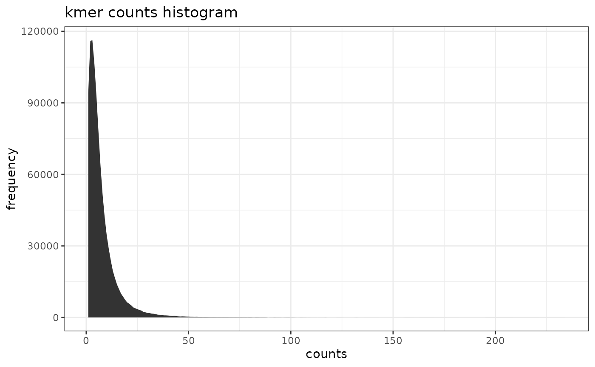
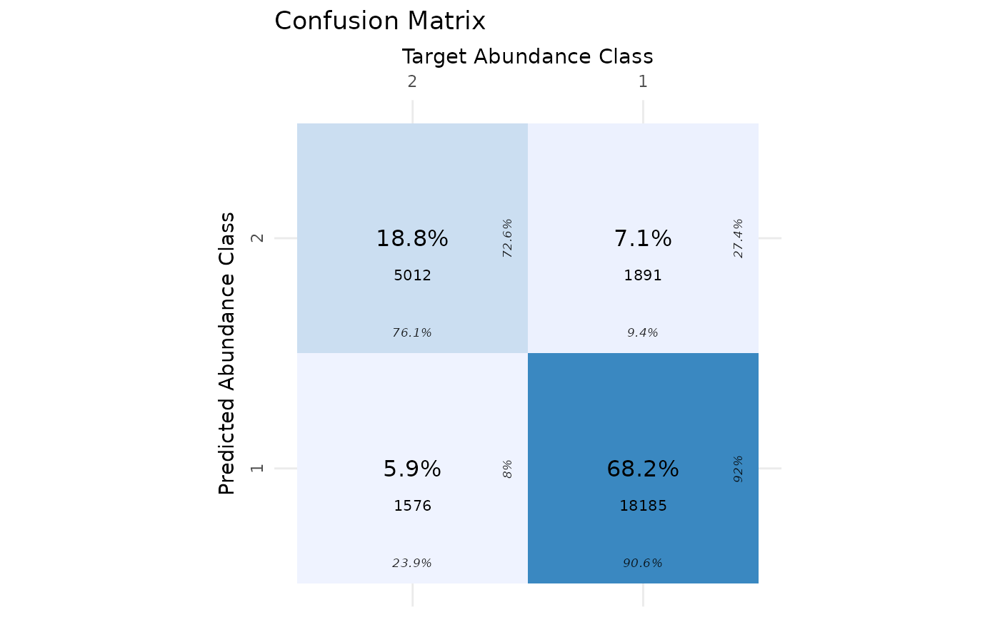

# metabinR

## About metabinR

`metabinR` performs abundance- and composition-based binning on
metagenomic samples directly from FASTA or FASTQ files. Abundance-based
binning (AB) analyzes long k-mers (k \> 8); composition-based binning
(CB) analyzes short k-mers (k \< 8); hierarchical binning (ABxCB) chains
the two.

The heavy lifting is implemented in Java and called via
[rJava](https://cran.r-project.org/package=rJava). From v2.0.0 the R API
returns an S4 `MetabinResult` object and accepts Biostrings / ShortRead
inputs in addition to file paths.

## Installation

``` r
if (!requireNamespace("BiocManager", quietly = TRUE))
    install.packages("BiocManager")
BiocManager::install("metabinR")
```

A JDK (Java \>= 17) must be available before installing `metabinR`.

## Preparation

### JVM heap size

JVM flags are passed through the `java.parameters` option. The `-Xmx`
flag controls the maximum heap: `-Xmx1500M` or `-Xmx3G`, etc. Set this
**before** loading the package.

``` r
options(java.parameters = "-Xmx1500M")
library(metabinR)
library(data.table)
library(dplyr)
library(ggplot2)
library(gridExtra)
library(cvms)
library(sabre)
library(Biostrings)
```

To customise additional JVM flags (on top of the `-Xmx` heap setting),
set `options(metabinR.jvm.flags = c("-XX:+UseG1GC", ...))` before the
package is loaded. The defaults returned by
[`metabinR_jvm_options()`](https://gkanogiannis.github.io/metabinR/reference/metabinR_jvm_options.md)
already enable G1GC and string deduplication.

## The `MetabinResult` class

Each binning function returns a `MetabinResult` S4 object:

- `assignments(res)` — `DataFrame` of per-read cluster assignments.
- `nClusters(res)` — number of clusters produced.
- `parameters(res)` — list of parameters actually used.
- `algorithm(res)` — `"AB"`, `"CB"`, or `"ABxCB"`.
- `as.data.frame(res)` — the v1.x tabular layout for back-compat.

## Abundance based binning example

The toy simulated metagenome contains 26,664 Illumina reads (13,332
pairs of 2x150bp) sampled from 10 bacterial genomes across two abundance
classes (high vs. low).

Abundance ground truth:

``` r
abundances <- read.table(
    system.file("extdata", "distribution_0.txt", package = "metabinR"),
    col.names = c("genome_id", "abundance", "AB_id"))
```

Read-level ground truth:

``` r
reads.mapping <- fread(
        system.file("extdata", "reads_mapping.tsv.gz", package = "metabinR")) %>%
    merge(abundances[, c("genome_id", "AB_id")], by = "genome_id") %>%
    arrange(anonymous_read_id)
```

Run abundance-based binning with 10-mers into 2 clusters:

``` r
res.AB <- abundance_based_binning(
    system.file("extdata", "reads.metagenome.fasta.gz", package = "metabinR"),
    numOfClustersAB = 2,
    kMerSizeAB = 10,
    dryRun = FALSE,
    outputAB = "vignette"
)
res.AB
#> MetabinResult (AB)
#>   reads:     26,664
#>   clusters:  2
#>   inputs:    1 file(s)
#>     - /home/runner/work/_temp/Library/metabinR/extdata/reads.metagenome.fasta.gz
```

`res.AB` is a `MetabinResult`. Extract the per-read table and pull the
cluster labels out of it:

``` r
assignments.AB <- as.data.frame(res.AB) %>% arrange(read_id)
```

[`abundance_based_binning()`](https://gkanogiannis.github.io/metabinR/reference/abundance_based_binning.md)
wrote one FASTA per cluster and a k-mer count histogram:

``` r
histogram.AB <- read.table("vignette__AB.histogram.tsv", header = TRUE)
ggplot(histogram.AB, aes(x = counts, y = frequency)) +
    geom_area() +
    labs(title = "kmer counts histogram") +
    theme_bw()
```



Evaluate against the abundance-class ground truth:

``` r
eval.AB.cvms <- cvms::evaluate(
    data = data.frame(
        prediction = as.character(assignments.AB$AB),
        target = as.character(reads.mapping$AB_id),
        stringsAsFactors = FALSE),
    target_col = "target",
    prediction_cols = "prediction",
    type = "binomial"
)
eval.AB.sabre <- sabre::vmeasure(
    as.character(assignments.AB$AB),
    as.character(reads.mapping$AB_id))

p <- cvms::plot_confusion_matrix(eval.AB.cvms) +
    labs(title = "Confusion Matrix",
         x = "Target Abundance Class",
         y = "Predicted Abundance Class")
tab <- as.data.frame(
    c(
        Accuracy    = round(eval.AB.cvms$Accuracy, 4),
        Specificity = round(eval.AB.cvms$Specificity, 4),
        Sensitivity = round(eval.AB.cvms$Sensitivity, 4),
        Fscore      = round(eval.AB.cvms$F1, 4),
        Kappa       = round(eval.AB.cvms$Kappa, 4),
        Vmeasure    = round(eval.AB.sabre$v_measure, 4)
    )
)
grid.arrange(p, ncol = 1)
```



``` r
knitr::kable(tab, caption = "AB binning evaluation", col.names = NULL)
```

|             |        |
|:------------|-------:|
| Accuracy    | 0.8700 |
| Specificity | 0.9058 |
| Sensitivity | 0.7608 |
| Fscore      | 0.7430 |
| Kappa       | 0.6560 |
| Vmeasure    | 0.3553 |

AB binning evaluation

## Composition based binning example

Read-level ground truth (bacterial genome of origin):

``` r
reads.mapping <- fread(
        system.file("extdata", "reads_mapping.tsv.gz", package = "metabinR")) %>%
    arrange(anonymous_read_id)
```

Run composition-based binning with 4-mers into 10 clusters:

``` r
res.CB <- composition_based_binning(
    system.file("extdata", "reads.metagenome.fasta.gz", package = "metabinR"),
    numOfClustersCB = 10,
    kMerSizeCB = 4,
    dryRun = TRUE,
    outputCB = "vignette"
)
assignments.CB <- as.data.frame(res.CB) %>% arrange(read_id)
```

As a pure clustering task, evaluate with extrinsic measures:

``` r
eval.CB.sabre <- sabre::vmeasure(
    as.character(assignments.CB$CB),
    as.character(reads.mapping$genome_id))
tab <- as.data.frame(
    c(
        Vmeasure     = round(eval.CB.sabre$v_measure, 4),
        Homogeneity  = round(eval.CB.sabre$homogeneity, 4),
        Completeness = round(eval.CB.sabre$completeness, 4)
    )
)
knitr::kable(tab, caption = "CB binning evaluation", col.names = NULL)
```

|              |        |
|:-------------|-------:|
| Vmeasure     | 0.2258 |
| Homogeneity  | 0.1880 |
| Completeness | 0.2826 |

CB binning evaluation

## Hierarchical (2-step ABxCB) binning example

``` r
res.ABxCB <- hierarchical_binning(
    system.file("extdata", "reads.metagenome.fasta.gz", package = "metabinR"),
    numOfClustersAB = 2,
    kMerSizeAB = 10,
    kMerSizeCB = 4,
    dryRun = TRUE,
    outputC = "vignette"
)
assignments.ABxCB <- as.data.frame(res.ABxCB) %>% arrange(read_id)

eval.ABxCB.sabre <- sabre::vmeasure(
    as.character(assignments.ABxCB$ABxCB),
    as.character(reads.mapping$genome_id))
tab <- as.data.frame(
    c(
        Vmeasure     = round(eval.ABxCB.sabre$v_measure, 4),
        Homogeneity  = round(eval.ABxCB.sabre$homogeneity, 4),
        Completeness = round(eval.ABxCB.sabre$completeness, 4)
    )
)
knitr::kable(tab, caption = "ABxCB binning evaluation", col.names = NULL)
```

|              |        |
|:-------------|-------:|
| Vmeasure     | 0.2830 |
| Homogeneity  | 0.4722 |
| Completeness | 0.2021 |

ABxCB binning evaluation

## In-memory inputs (Biostrings / ShortRead)

Instead of a path, you can pass a `DNAStringSet`,
`QualityScaledDNAStringSet`, or `ShortReadQ`. The Java backend reads
from disk, so non-file inputs are staged to a tempfile transparently.

``` r
reads <- Biostrings::readDNAStringSet(
    system.file("extdata", "reads.metagenome.fasta.gz", package = "metabinR"))

res.AB.mem <- abundance_based_binning(
    reads,
    numOfClustersAB = 2,
    kMerSizeAB = 10,
    dryRun = TRUE
)
identical(nrow(assignments(res.AB.mem)), nrow(assignments(res.AB)))
#> [1] TRUE
```

Clean up files written by the AB run:

``` r
unlink("vignette__*")
```

## Session Info

``` r
utils::sessionInfo()
#> R version 4.6.0 (2026-04-24)
#> Platform: x86_64-pc-linux-gnu
#> Running under: Ubuntu 24.04.4 LTS
#> 
#> Matrix products: default
#> BLAS:   /usr/lib/x86_64-linux-gnu/openblas-pthread/libblas.so.3 
#> LAPACK: /usr/lib/x86_64-linux-gnu/openblas-pthread/libopenblasp-r0.3.26.so;  LAPACK version 3.12.0
#> 
#> locale:
#>  [1] LC_CTYPE=C.UTF-8          LC_NUMERIC=C             
#>  [3] LC_TIME=C.UTF-8           LC_COLLATE=C.UTF-8       
#>  [5] LC_MONETARY=C.UTF-8       LC_MESSAGES=C.UTF-8      
#>  [7] LC_PAPER=C.UTF-8          LC_NAME=C.UTF-8          
#>  [9] LC_ADDRESS=C.UTF-8        LC_TELEPHONE=C.UTF-8     
#> [11] LC_MEASUREMENT=C.UTF-8    LC_IDENTIFICATION=C.UTF-8
#> 
#> time zone: UTC
#> tzcode source: system (glibc)
#> 
#> attached base packages:
#> [1] stats4    stats     graphics  grDevices utils     datasets  methods  
#> [8] base     
#> 
#> other attached packages:
#>  [1] Biostrings_2.79.5   Seqinfo_1.1.0       XVector_0.51.0     
#>  [4] IRanges_2.45.0      S4Vectors_0.49.2    BiocGenerics_0.57.1
#>  [7] generics_0.1.4      sabre_0.4.3         cvms_2.0.0         
#> [10] gridExtra_2.3       ggplot2_4.0.3       dplyr_1.2.1        
#> [13] data.table_1.18.2.1 metabinR_1.99.0     BiocStyle_2.39.0   
#> 
#> loaded via a namespace (and not attached):
#>  [1] tidyselect_1.2.1            farver_2.1.2               
#>  [3] R.utils_2.13.0              S7_0.2.2                   
#>  [5] bitops_1.0-9                fastmap_1.2.0              
#>  [7] pROC_1.19.0.1               GenomicAlignments_1.47.0   
#>  [9] digest_0.6.39               lifecycle_1.0.5            
#> [11] sf_1.1-0                    pwalign_1.7.0              
#> [13] terra_1.9-11                magrittr_2.0.5             
#> [15] compiler_4.6.0              rlang_1.2.0                
#> [17] sass_0.4.10                 tools_4.6.0                
#> [19] yaml_2.3.12                 knitr_1.51                 
#> [21] labeling_0.4.3              S4Arrays_1.11.1            
#> [23] classInt_0.4-11             interp_1.1-6               
#> [25] sp_2.2-1                    DelayedArray_0.37.1        
#> [27] plyr_1.8.9                  RColorBrewer_1.1-3         
#> [29] KernSmooth_2.23-26          abind_1.4-8                
#> [31] ShortRead_1.69.4            BiocParallel_1.45.0        
#> [33] withr_3.0.2                 purrr_1.2.2                
#> [35] hwriter_1.3.2.1             R.oo_1.27.1                
#> [37] desc_1.4.3                  grid_4.6.0                 
#> [39] latticeExtra_0.6-31         e1071_1.7-17               
#> [41] scales_1.4.0                SummarizedExperiment_1.41.1
#> [43] cli_3.6.6                   rmarkdown_2.31             
#> [45] crayon_1.5.3                ragg_1.5.2                 
#> [47] proxy_0.4-29                DBI_1.3.0                  
#> [49] cachem_1.1.0                parallel_4.6.0             
#> [51] BiocManager_1.30.27         matrixStats_1.5.0          
#> [53] vctrs_0.7.3                 Matrix_1.7-5               
#> [55] jsonlite_2.0.0              bookdown_0.46              
#> [57] systemfonts_1.3.2           jpeg_0.1-11                
#> [59] jquerylib_0.1.4             tidyr_1.3.2                
#> [61] units_1.0-1                 glue_1.8.1                 
#> [63] pkgdown_2.2.0               codetools_0.2-20           
#> [65] rJava_1.0-18                gtable_0.3.6               
#> [67] deldir_2.0-4                raster_3.6-32              
#> [69] GenomicRanges_1.63.2        tibble_3.3.1               
#> [71] pillar_1.11.1               htmltools_0.5.9            
#> [73] entropy_1.3.2               R6_2.6.1                   
#> [75] textshaping_1.0.5           evaluate_1.0.5             
#> [77] lattice_0.22-9              Biobase_2.71.0             
#> [79] R.methodsS3_1.8.2           png_0.1-9                  
#> [81] backports_1.5.1             Rsamtools_2.27.2           
#> [83] cigarillo_1.1.0             bslib_0.10.0               
#> [85] class_7.3-23                Rcpp_1.1.1-1               
#> [87] SparseArray_1.11.13         checkmate_2.3.4            
#> [89] xfun_0.57                   fs_2.1.0                   
#> [91] MatrixGenerics_1.23.0       pkgconfig_2.0.3
```
