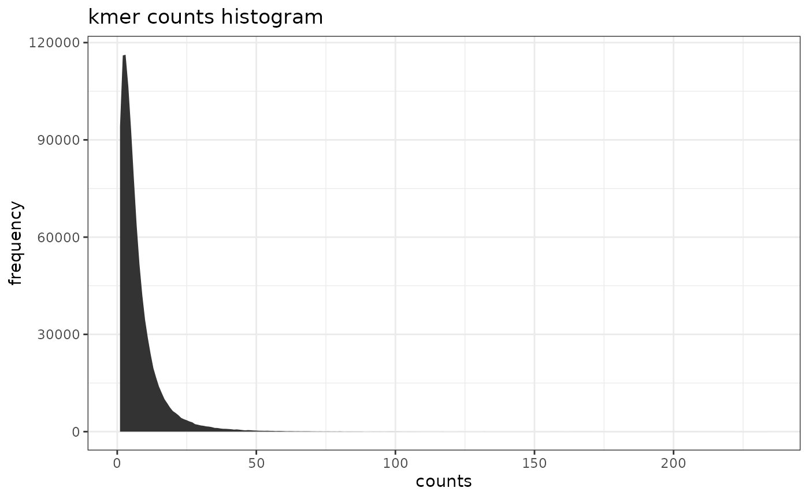

# metabinR

## About metabinR

`metabinR` performs abundance- and composition-based binning on
metagenomic samples directly from FASTA or FASTQ files. Abundance-based
binning (AB) analyzes long k-mers (k \> 8); composition-based binning
(CB) analyzes short k-mers (k \< 8); hierarchical binning (ABxCB) chains
the two.

The heavy lifting is implemented in Java and called via
[rJava](https://cran.r-project.org/package=rJava). From v2.0.0 the R API
returns an S4 `MetabinResult` object and accepts Biostrings / ShortRead
inputs in addition to file paths.

## Installation

``` r

if (!requireNamespace("BiocManager", quietly = TRUE))
    install.packages("BiocManager")
BiocManager::install("metabinR")
```

A JDK (Java \>= 11) must be available before installing `metabinR`.

## Preparation

### JVM heap size

JVM flags are passed through the `java.parameters` option. The `-Xmx`
flag controls the maximum heap: `-Xmx1500M` or `-Xmx3G`, etc. Set this
**before** loading the package.

``` r

options(java.parameters = "-Xmx1500M")
library(metabinR)
library(ggplot2)
library(Biostrings)
```

To customise additional JVM flags (on top of the `-Xmx` heap setting),
set `options(metabinR.jvm.flags = c("-XX:+UseG1GC", ...))` before the
package is loaded. The defaults returned by
[`metabinR_jvm_options()`](https://gkanogiannis.github.io/metabinR/reference/metabinR_jvm_options.md)
already enable G1GC and string deduplication.

## The `MetabinResult` class

Each binning function returns a `MetabinResult` S4 object:

- `assignments(res)` — `DataFrame` of per-read cluster assignments.
- `nClusters(res)` — number of clusters produced.
- `parameters(res)` — list of parameters actually used.
- `algorithm(res)` — `"AB"`, `"CB"`, or `"ABxCB"`.
- `as.data.frame(res)` — the v1.x tabular layout for back-compat.

The `read_id` column identifies each read. The column named by
`algorithm(res)` contains its assigned bin, and columns such as `AB.1`
contain distances to candidate bins. Bin numbers are arbitrary labels;
they do not identify genomes or abundance classes on their own.

## Abundance based binning example

The toy simulated metagenome contains 26,664 Illumina reads (13,332
pairs of 2x150bp) sampled from 10 bacterial genomes across two abundance
classes (high vs. low).

Abundance ground truth:

``` r

abundances <- read.table(
    system.file("extdata", "distribution_0.txt", package = "metabinR"),
    col.names = c("genome_id", "abundance", "AB_id"))
```

Read-level ground truth contains the genome of origin for each read. Add
the abundance class of each genome for the AB evaluation:

``` r

reads.mapping <- read.delim(system.file(
    "extdata", "reads_mapping.tsv.gz", package = "metabinR"))
reads.mapping <- merge(reads.mapping,
                       abundances[, c("genome_id", "AB_id")],
                       by = "genome_id")
```

Run abundance-based binning with 10-mers into 2 clusters:

``` r

res.AB <- abundance_based_binning(
    system.file("extdata", "reads.metagenome.fasta.gz", package = "metabinR"),
    numOfClustersAB = 2,
    kMerSizeAB = 10,
    dryRun = FALSE,
    outputAB = "vignette"
)
res.AB
#> MetabinResult (AB)
#>   reads:     26,664
#>   clusters:  2
#>   inputs:    1 file(s)
#>     - /home/runner/work/_temp/Library/metabinR/extdata/reads.metagenome.fasta.gz
```

Inspect the assignments and summarize the observed bins. The distance
summaries use only each read’s distance to its assigned bin:

``` r

head(as.data.frame(assignments(res.AB)))
#>   read_id AB        AB.1        AB.2
#> 1  S0R0/1  1 0.032307751 0.004981781
#> 2  S0R0/2  1 0.030796454 0.005614620
#> 3  S0R1/1  1 0.021667648 0.009437209
#> 4  S0R1/2  1 0.019364505 0.010336333
#> 5  S0R2/1  1 0.013742806 0.012755650
#> 6  S0R2/2  2 0.009775655 0.014416852
knitr::kable(as.data.frame(bin_summary(res.AB)), digits = 3)
```

| bin | n_reads | proportion | mean_distance | median_distance |
|:----|--------:|-----------:|--------------:|----------------:|
| 1   |   19761 |      0.741 |         0.024 |           0.024 |
| 2   |    6903 |      0.259 |         0.015 |           0.015 |

[`abundance_based_binning()`](https://gkanogiannis.github.io/metabinR/reference/abundance_based_binning.md)
wrote one FASTA per cluster and a k-mer count histogram:

``` r

histogram.AB <- read.table("vignette__AB.histogram.tsv", header = TRUE)
ggplot(histogram.AB, aes(x = counts, y = frequency)) +
    geom_area() +
    labs(title = "kmer counts histogram") +
    theme_bw()
```



Evaluate against the abundance-class ground truth.
[`evaluate_bins()`](https://gkanogiannis.github.io/metabinR/reference/evaluate_bins.md)
matches `read_id` to `anonymous_read_id`, so the two tables need not
have the same row order. The confusion table has inferred bins as rows
and known abundance classes as columns:

``` r

eval.AB <- evaluate_bins(res.AB, reads.mapping,
                         id = "anonymous_read_id", label = "AB_id")
eval.AB$confusion
#>    origin
#> bin     1     2
#>   1 18185  1576
#>   2  1891  5012
knitr::kable(as.data.frame(eval.AB$per_bin), digits = 3)
```

| bin | n_reads | dominant_origin | dominant_reads | purity |
|:----|--------:|:----------------|---------------:|-------:|
| 1   |   19761 | 1               |          18185 |  0.920 |
| 2   |    6903 | 2               |           5012 |  0.726 |

``` r

knitr::kable(as.data.frame(eval.AB$overall), digits = 3)
```

| n_reads | n_bins | n_origins | weighted_purity | weighted_recovery | adjusted_rand_index |
|---:|---:|---:|---:|---:|---:|
| 26664 | 2 | 2 | 0.87 | 0.87 | 0.519 |

Per-bin purity is the fraction of reads in a bin from its dominant
abundance class. The adjusted Rand index (ARI) compares the two
partitions without assuming that their labels correspond.

## Composition based binning example

Here the known label is the bacterial genome of origin, rather than the
abundance class used above.

Run composition-based binning with 4-mers into 10 clusters:

``` r

res.CB <- composition_based_binning(
    system.file("extdata", "reads.metagenome.fasta.gz", package = "metabinR"),
    numOfClustersCB = 10,
    kMerSizeCB = 4,
    dryRun = TRUE,
    outputCB = "vignette"
)
```

Check bin sizes and inspect reads with close competing distances. The
`margin` is an absolute distance difference on this algorithm’s scale,
not a probability. A small result can mean either that few reads are
close to a boundary or that the chosen margin is too narrow:

``` r

knitr::kable(as.data.frame(bin_summary(res.CB)), digits = 3)
```

| bin | n_reads | proportion | mean_distance | median_distance |
|:----|--------:|-----------:|--------------:|----------------:|
| 7   |    5687 |      0.213 |      15463.45 |           15354 |
| 10  |    1450 |      0.054 |      16622.33 |           16688 |
| 6   |    1036 |      0.039 |      15260.93 |           15099 |
| 3   |    7571 |      0.284 |      16480.01 |           16472 |
| 5   |    2855 |      0.107 |      15620.85 |           15452 |
| 1   |    1708 |      0.064 |      16207.55 |           16081 |
| 9   |    3974 |      0.149 |      15891.34 |           15757 |
| 4   |    1215 |      0.046 |      15094.21 |           14892 |
| 8   |     539 |      0.020 |      16352.11 |           16174 |
| 2   |     629 |      0.024 |      16610.71 |           16412 |

``` r

close.reads <- ambiguous_reads(res.CB, margin = 0.05)
nrow(close.reads)
#> [1] 15
knitr::kable(head(as.data.frame(close.reads)), digits = 3)
```

| read_id   | bin | best_distance | second_distance | distance_margin |
|:----------|:----|--------------:|----------------:|----------------:|
| S0R774/2  | 5   |         15726 |           15726 |               0 |
| S0R2707/2 | 4   |         16176 |           16176 |               0 |
| S0R3591/1 | 5   |         15214 |           15214 |               0 |
| S0R5272/1 | 5   |         15904 |           15904 |               0 |
| S0R5811/2 | 6   |         17310 |           17310 |               0 |
| S0R7348/1 | 1   |         16936 |           16936 |               0 |

Evaluate by genome of origin. Best-bin recovery is the fraction of an
origin’s reads found in its single largest bin; it is not genome
completeness. Weighted purity and recovery summarize these counts over
all evaluated reads:

``` r

eval.CB <- evaluate_bins(res.CB, reads.mapping,
                         id = "anonymous_read_id", label = "genome_id")
knitr::kable(as.data.frame(eval.CB$per_origin), digits = 3)
```

| origin     | n_reads | dominant_bin | recovered_reads | best_bin_recovery |
|:-----------|--------:|:-------------|----------------:|------------------:|
| Genome15.0 |   14190 | 7            |            5136 |             0.362 |
| Genome3.0  |    5886 | 9            |            1565 |             0.266 |
| Genome2.0  |     538 | 3            |             219 |             0.407 |
| Genome12.0 |    3782 | 3            |            3677 |             0.972 |
| Genome11.0 |    1186 | 3            |            1152 |             0.971 |
| Genome6.0  |     356 | 2            |              57 |             0.160 |
| Genome17.0 |     594 | 1            |             233 |             0.392 |
| Genome22.0 |       8 | 3            |               6 |             0.750 |
| Genome23.0 |      80 | 3            |              80 |             1.000 |
| Genome4.0  |      44 | 2            |              14 |             0.318 |

``` r

knitr::kable(as.data.frame(eval.CB$overall), digits = 3)
```

| n_reads | n_bins | n_origins | weighted_purity | weighted_recovery | adjusted_rand_index |
|---:|---:|---:|---:|---:|---:|
| 26664 | 10 | 10 | 0.615 | 0.455 | 0.12 |

## Hierarchical (2-step ABxCB) binning example

``` r

res.ABxCB <- hierarchical_binning(
    system.file("extdata", "reads.metagenome.fasta.gz", package = "metabinR"),
    numOfClustersAB = 2,
    kMerSizeAB = 10,
    kMerSizeCB = 4,
    dryRun = TRUE,
    outputC = "vignette"
)
knitr::kable(as.data.frame(bin_summary(res.ABxCB)), digits = 3)
```

| bin | n_reads | proportion | mean_distance | median_distance |
|:----|--------:|-----------:|--------------:|----------------:|
| 1   |   19761 |      0.741 |      16731.08 |           16490 |
| 2   |    6903 |      0.259 |      16773.47 |           16304 |

``` r

eval.ABxCB <- evaluate_bins(res.ABxCB, reads.mapping,
                            id = "anonymous_read_id", label = "genome_id")
knitr::kable(as.data.frame(eval.ABxCB$overall), digits = 3)
```

| n_reads | n_bins | n_origins | weighted_purity | weighted_recovery | adjusted_rand_index |
|---:|---:|---:|---:|---:|---:|
| 26664 | 2 | 10 | 0.62 | 0.904 | 0.298 |

In hierarchical results, distances for bins outside a read’s parent
abundance bin are missing.
[`ambiguous_reads()`](https://gkanogiannis.github.io/metabinR/reference/ambiguous_reads.md)
ignores those missing distances and omits reads with fewer than two
finite candidates.

## In-memory inputs (Biostrings / ShortRead)

Instead of a path, you can pass a `DNAStringSet`,
`QualityScaledDNAStringSet`, or `ShortReadQ`. The Java backend reads
from disk, so non-file inputs are staged to a tempfile transparently.

``` r

reads <- Biostrings::readDNAStringSet(
    system.file("extdata", "reads.metagenome.fasta.gz", package = "metabinR"))

res.AB.mem <- abundance_based_binning(
    reads,
    numOfClustersAB = 2,
    kMerSizeAB = 10,
    dryRun = TRUE
)
identical(nrow(assignments(res.AB.mem)), nrow(assignments(res.AB)))
#> [1] TRUE
```

Clean up files written by the AB run:

``` r

unlink("vignette__*")
```

## Session Info

``` r

utils::sessionInfo()
#> R version 4.6.1 (2026-06-24)
#> Platform: x86_64-pc-linux-gnu
#> Running under: Ubuntu 24.04.5 LTS
#> 
#> Matrix products: default
#> BLAS:   /usr/lib/x86_64-linux-gnu/openblas-pthread/libblas.so.3 
#> LAPACK: /usr/lib/x86_64-linux-gnu/openblas-pthread/libopenblasp-r0.3.26.so;  LAPACK version 3.12.0
#> 
#> locale:
#>  [1] LC_CTYPE=C.UTF-8          LC_NUMERIC=C             
#>  [3] LC_TIME=C.UTF-8           LC_COLLATE=C.UTF-8       
#>  [5] LC_MONETARY=C.UTF-8       LC_MESSAGES=C.UTF-8      
#>  [7] LC_PAPER=C.UTF-8          LC_NAME=C.UTF-8          
#>  [9] LC_ADDRESS=C.UTF-8        LC_TELEPHONE=C.UTF-8     
#> [11] LC_MEASUREMENT=C.UTF-8    LC_IDENTIFICATION=C.UTF-8
#> 
#> time zone: UTC
#> tzcode source: system (glibc)
#> 
#> attached base packages:
#> [1] stats4    stats     graphics  grDevices utils     datasets  methods  
#> [8] base     
#> 
#> other attached packages:
#>  [1] Biostrings_2.80.2   Seqinfo_1.2.0       XVector_0.52.0     
#>  [4] IRanges_2.46.0      S4Vectors_0.50.3    BiocGenerics_0.58.1
#>  [7] generics_0.1.4      ggplot2_4.0.3       metabinR_2.1.1     
#> [10] BiocStyle_2.40.0   
#> 
#> loaded via a namespace (and not attached):
#>  [1] SummarizedExperiment_1.42.0 gtable_0.3.6               
#>  [3] xfun_0.61                   bslib_0.12.0               
#>  [5] hwriter_1.3.2.1             latticeExtra_0.6-31        
#>  [7] rJava_1.0-18                Biobase_2.72.0             
#>  [9] lattice_0.22-9              vctrs_0.7.3                
#> [11] tools_4.6.1                 bitops_1.1-0               
#> [13] parallel_4.6.1              tibble_3.3.1               
#> [15] pkgconfig_2.0.3             Matrix_1.7-5               
#> [17] checkmate_2.3.4             RColorBrewer_1.1-3         
#> [19] S7_0.2.2                    desc_1.4.3                 
#> [21] cigarillo_1.2.1             lifecycle_1.0.5            
#> [23] farver_2.1.2                compiler_4.6.1             
#> [25] deldir_2.0-4                Rsamtools_2.28.0           
#> [27] textshaping_1.0.5           codetools_0.2-20           
#> [29] htmltools_0.5.9             sass_0.4.10                
#> [31] yaml_2.3.12                 pillar_1.11.1              
#> [33] pkgdown_2.2.1               crayon_1.5.3               
#> [35] jquerylib_0.1.4             BiocParallel_1.46.0        
#> [37] DelayedArray_0.38.2         cachem_1.1.0               
#> [39] ShortRead_1.70.0            abind_1.4-8                
#> [41] tidyselect_1.2.1            digest_0.6.39              
#> [43] dplyr_1.2.1                 bookdown_0.48              
#> [45] labeling_0.4.3              fastmap_1.2.0              
#> [47] grid_4.6.1                  cli_3.6.6                  
#> [49] SparseArray_1.12.3          magrittr_2.0.5             
#> [51] S4Arrays_1.12.1             withr_3.0.3                
#> [53] scales_1.4.0                backports_1.5.1            
#> [55] rmarkdown_2.32              pwalign_1.8.0              
#> [57] matrixStats_1.5.0           jpeg_0.1-11                
#> [59] interp_1.1-6                otel_0.2.0                 
#> [61] ragg_1.5.2                  png_0.1-9                  
#> [63] evaluate_1.0.5              knitr_1.52                 
#> [65] GenomicRanges_1.64.0        rlang_1.3.0                
#> [67] Rcpp_1.1.2                  glue_1.8.1                 
#> [69] BiocManager_1.30.27         jsonlite_2.0.0             
#> [71] R6_2.6.1                    MatrixGenerics_1.24.0      
#> [73] GenomicAlignments_1.48.0    systemfonts_1.3.2          
#> [75] fs_2.1.0
```
